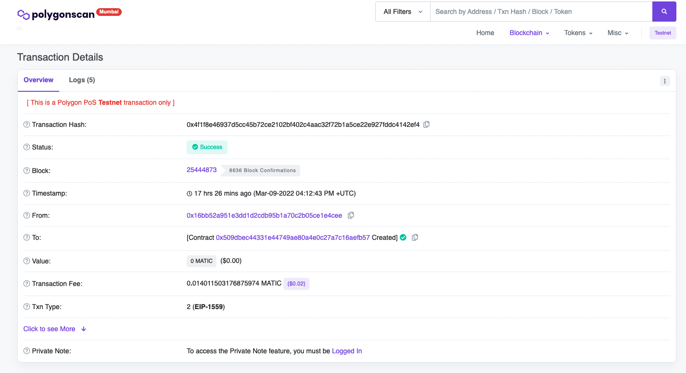

# Creating an NFT

To create an NFT you need to deploy a version of the [Open Format contract](https://github.com/simpleweb/open-format-contracts/blob/main/contracts/OpenFormat.sol). Open Format has chosen to use the [Polygon Network](https://polygon.technology/) due to its speed, reliability and low transactions fees. For this guide we're using [Polygon Mumbai](https://mumbai.polygonscan.com/), which is Polygon's test network. Polygon is built on top of the Ethereum blockchain.

## Prerequisites

* [Node.js](https://nodejs.org/en/) (>= 16.15.1) installed
* A basic understanding of how the Ethereum blockchain works
* A basic understanding of JavaScript

### Ethereum wallet

This example requires an Ethereum wallet (we recommend using [Metamask](https://metamask.io/) to create yourself a wallet). Once you've created a wallet, you will need to do two things:

1. Get your private key.
   * Read this [guide](https://metamask.zendesk.com/hc/en-us/articles/360015289632-How-to-Export-an-Account-Private-Key) to find out how get your private key from [Metamask](https://metamask.io/).
2. Add some MATIC Token from the [Polygon Faucet](https://faucet.polygon.technology/).
   * Every transaction on the Ethereum blockchain costs [gas](https://www.youtube.com/watch?v=hQ78FVSv-vs). MATIC Token is the network token for the Polygon Network. We need some MATIC tokens in our wallet to cover the gas fees for the deployment transaction in this guide.

## Project Setup


You can use our example project to get up and running even faster. Install it with the following command, install the dependencies and update `YOUR_PRIVATE_KEY` with your private key.

`npx degit simpleweb/open-format/examples/node-deploy example`


First create a new project to work with.

```bash
mkdir example && cd example
npm init -y
code .
```

Set your script to be treated as an ES module.


```json
{
  "type": "module"
}
```


Install the required dependencies using npm or yarn.

```bash
yarn add @simpleweb/open-format ethers

npm install @simpleweb/open-format ethers
```

## Code

Now you're all setup we can start writing some code. Create an `index.js` file in the root of your project.

Import and create a new instance of the SDK with your private key as the signer and the network set to use Mumbai.


```typescript
import { OpenFormatSDK } from "@simpleweb/open-format";

const sdk = new OpenFormatSDK({
  network: "mumbai",
  signer: "0x...",
});
```


Next we need to create our function to deploy the contract.


```typescript
console.log("Deploying...");

const { transactionHash } = await sdk.deploy({
  maxSupply: 100,
  mintingPrice: 0.01,
  name: "Test 1",
  symbol: "TEST1",
  url: "ipfs://"
});

console.log(
  `View on Polygonscan: https://mumbai.polygonscan.com/tx/${transactionHash}`
);

console.log("Complete!");
```


Save the file and run it.

```bash
node index.js
```

If everything is working as expected you should see a message saying Deploying....

Wait for a minute or so and your deployment should be complete! Click the link in your terminal to view the transaction on Polygonscan.



Congratulations! You've created your first NFT! Now we can find your NFT by reading from the subgraph.
